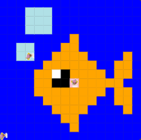

# Unit 1 - Asphalt Art

## Introduction

Cities use asphalt art to improve public safety, inspire their residents and visitors, and brighten communities. Your goal is to create asphalt art to revitalize The Neighborhood and bring the community together with the help of the Painter.

## Requirements

Use your knowledge of object-oriented programming, algorithms, the problem solving process, and decomposition strategies to create asphalt art:
- **Create a new subclass** – Create at least one new subclass of the PainterPlus class that is used for a component of the asphalt art design.
- **Plan an algorithm** – Use the problem solving process and decomposition strategies to plan an algorithm that incorporates a combination of sequencing, selection, and/or iteration.
- **Write a method** – Write at least one method in a PainterPlus subclass that contributes to a component of the asphalt art design.
- **Document your code** – Use comments to explain the purpose of the methods and code segments.

## Notes: Neighborhood & Painter Class

This project was created on Code.org's JavaLab platform using the built-in Neighborhood GUI output. To test and edit this project you must build in Code.org's JavaLab with the Neighborhood GUI enabled. For reference to the Painter class documentation, [you can read more here.](https://studio.code.org/docs/ide/javalab/classes/Painter)

## Output:

## Reflection

1. Describe your project.

   My project is an image of my favorite sea creature, a gold fish. I am actually not sure if they really live anywhere but home fishtanks, but that is not the point. I have one painter for the background, one for the bubbles, and one for the actual fish.

2. What are two things about your project that you are proud of?

   The first thing that I am proud of is the fact that I coded the whole fish without asking for help. I am also proud that I used different methods, that I also created, to help make the code to make the first body simpler. 

3. Describe something you would improve or do differently if you had an opportunity to change something about your project.

   One thing I would do if I wanted to change something would be to shorten the code on my fish body. It is a lot of code. Another thing I would do to improve it would be to add some dimension to the water the fish is in.
